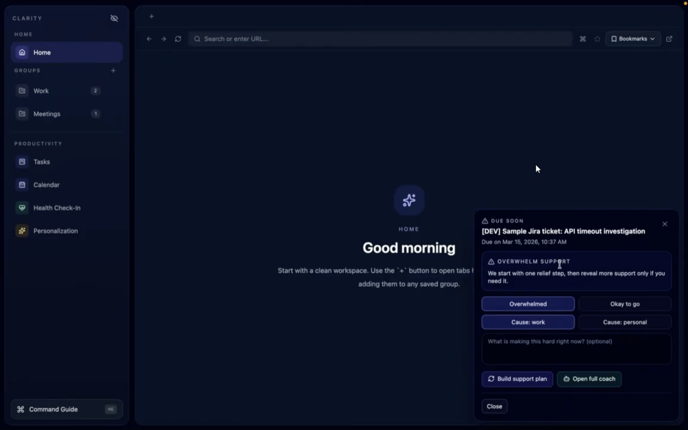
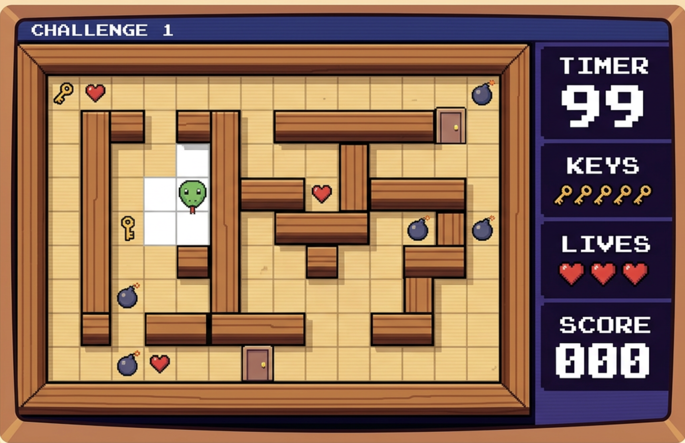

<h1 align="center">Hey, I'm Pranav Kumar 👋</h1>

<p align="center">
  <b>Computer Science @ University of Calgary</b><br/>
  Building software, exploring AI, and turning ideas into usable projects.
</p>

<p align="center">
  <a href="https://github.com/kmrpranav"></a>
  <a href="https://www.linkedin.com/in/kupranav/">
    
  </a>
</p>

---

### 🧑‍💻 About Me

```bash
> whoami
Pranav Kumar — Bachelors of Computer Science at Uofc 

> location
Calgary, Alberta 🇨🇦

> interests
full-stack development • AI tools • productivity apps • games • clean APIs

> currently_building
projects that are practical, polished, and fun to use

> mindset
learn fast, build faster, improve constantly
```

---

### 🛠 Tech Stack

<p>
  
</p>

---

### 🚀 Featured Work

| Project | What it shows |
|---|---|
| **SnakeGame** | C programming, game logic, fundamentals |
| **CalgaryHacks25** | JavaScript, hackathon-style teamwork, fast prototyping |
| **Footnotes** | Python, API bridge work, backend thinking |
| **clarity-browser** | TypeScript, productivity software, AI integration |
| **481fittracker** | JavaScript, app development, user-focused features |

---

### 📊 GitHub Snapshot

<p align="center">
  
</p>


<p align="center">
  
</p>

---

### 🧩 What I Like Building

- useful web apps with clean interfaces  
- tools that make people more productive  
- AI-powered features that feel practical, not gimmicky  
- small games and experiments that sharpen fundamentals  

---

<p align="center">
  <i>"Build things. Break things. Learn from both."</i>
</p>

<!--
**kmrpranav/kmrpranav** is a ✨ _special_ ✨ repository because its `README.md` (this file) appears on your GitHub profile.

Here are some ideas to get you started:

- 🔭 I’m currently working on ...
- 🌱 I’m currently learning ...
- 👯 I’m looking to collaborate on ...
- 🤔 I’m looking for help with ...
- 💬 Ask me about ...
- 📫 How to reach me: ...
- 😄 Pronouns: ...
- ⚡ Fun fact: ...
-->
